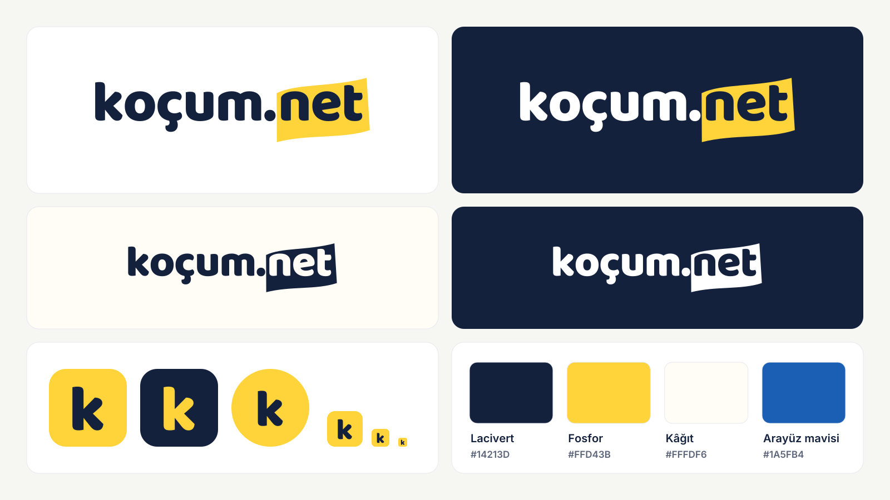

# design/brand — Koçum.Net marka kiti ("Fosfor")

Logo bir yazı: **koçum.net**, ve "net" fosforlu kalemle çizilmiş. Sınavda
önemli olan tek şey net; ders çalışan biri de önemli olanın üstünü çizer.



**Görsel rehber ve indirmeler:** `index.html` (tarayıcıda çift tıkla).

```
brand/
  build.mjs        ÜRETİCİ: aşağıdaki her şey buradan çıkar, elle düzenlenmez
  index.html       Marka rehberi: varyantlar, renkler, kurallar, indirme bağlantıları
  onizleme.png     Kitin tek bakışta görüntüsü (bu sayfanın başındaki)
  brand-paths.ts   Logo ve ikonun yol verisi (React bileşenleri bunu çizer)
  svg/             logo-{acik,koyu,tek-lacivert,tek-beyaz,otomatik}, logo-slogan-*,
                   ikon, ikon-lacivert, ikon-kare, ikon-maskable
  png/             logo-*-{256,512,1024,2048}, logo-slogan-*-{512,1024,2048},
                   ikon-{16…1024}, ikon-lacivert-*, apple-touch-icon-180,
                   ikon-maskable-512, favicon.ico (16/32/48), eposta-logo.png
  sosyal/          og-1200x630-{acik,koyu}, og-checkup-1200x630,
                   kapak-x-1500x500, kapak-linkedin-1584x396, profil-{1080,400}
```

## Yeniden üretmek

```bash
cd design
npm install                     # bir kez: opentype.js + sharp
npm run marka                   # brand/ altını baştan yazar
cd ..
node design/sync.mjs            # ikonları, yol verisini, görselleri üç projeye dağıtır
node design/sync.mjs --check    # kopyalar güncel mi (CI)
```

`build.mjs` Baloo 2 ExtraBold'u (`design/fonts`, SIL OFL) opentype.js ile
çizgiye çevirir. Logo hiçbir yerde yazı tipine bağlı değil: tarayıcıda,
e-postada, matbaada aynı görünür. Kalem şekli tek bir yol (`KALEM`), "net"in
kutusuna oturtulup -2,5° döndürülür. PNG'leri sharp üretir; `favicon.ico`
içinde 16, 32 ve 48 piksellik PNG'ler gömülü.

## Renkler

| Ad | HEX | Kullanım |
| --- | --- | --- |
| Lacivert | `#14213D` | Logo yazısı, başlıklar, koyu zemin |
| Fosforlu sarı | `#FFD43B` | **Yalnızca vurgu**: kalem, metin seçimi, başlıkta tek kelime |
| Kâğıt | `#FFFDF6` | Sıcak zemin: paylaşım görseli, afiş |
| Arayüz mavisi | `#1A5FB4` | Bağlantı ve düğme (tokens.css `--brand`) |

Sarı **asla metin rengi olmaz**: beyaz zeminde kontrast 1,4:1. Sarının üstündeki
yazı her zaman lacivert (11,2:1).

## Kurallar

- **Zemin:** açık zeminde `logo-acik`, koyu zeminde `logo-koyu`. Sarı ya da
  karışık fotoğraf zeminde tek renk sürüm. Zemin belli değilse (sistem teması)
  `logo-otomatik.svg`: koyu modda "koçum." kendiliğinden beyaz olur.
- **Boşluk:** her yanda en az "o" harfinin yüksekliği (logo genişliğinin ~%11'i).
- **En küçük boyut:** ekranda 96 px genişlik, baskıda 25 mm. Daha küçükse ikon (en az 16 px).
- **Slogan:** logo 160 px'ten darsa sloganlı sürüm kullanılmaz.
- **Yapılmaz:** esnetme, renk değiştirme, gölge/kontur, döndürme.

## Nerede kullanılıyor

| Yer | Dosya |
| --- | --- |
| Site üst çubuk, altbilgi, mobil menü | `frontend/components/LogoMark.tsx` (`Wordmark`, `LogoMark`) |
| Site yönetimi (kocum.net/admin) | `frontend/components/admin/AdminShell.tsx` |
| Check-up uygulaması | `app/components/ui/logo.tsx` |
| Check-up paneli | `admin/src/components/brand/Logo.tsx` |
| Sekme ikonu, Apple, PWA | sync → `*/app/icon.svg`, `favicon.ico`, `apple-icon.png`, `public/icons/` |
| E-posta başlığı | `backend/utils/mailer.js`, `app/lib/mailer.ts` → `/brand/eposta-logo.png` |
| Site paylaşım görseli | `frontend/app/[lang]/opengraph-image.tsx` (dile göre, yol verisinden çizer) |
| Check-up paylaşım görseli | sync → `app/app/opengraph-image.png` |
| Vurgu | `design/tokens.css`: `.marker` sınıfı, `::selection` |
